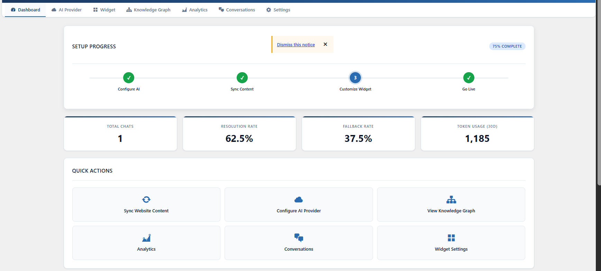
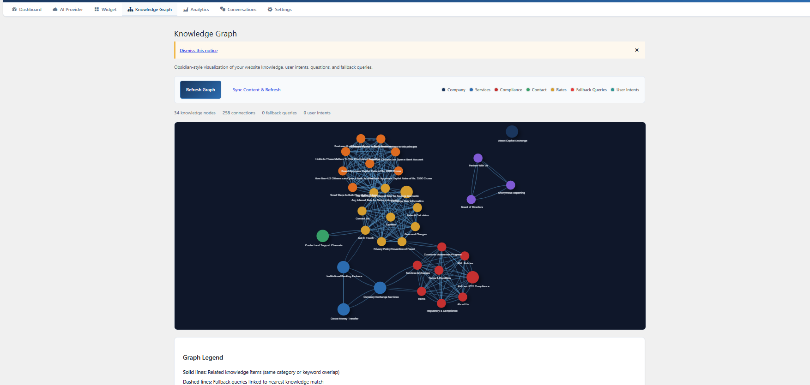

<p align="center">
  
</p>

<h1 align="center">AI Assistant with Knowledge Graph</h1>

<p align="center">
  <strong>The open-source, self-hostable WordPress AI chatbot with knowledge graph visualization, multi-provider AI support, and full branding customization.</strong>
</p>

<p align="center">
  <a href="#features">Features</a> •
  <a href="#screenshots">Screenshots</a> •
  <a href="#quick-start">Quick Start</a> •
  <a href="#docs">Docs</a> •
  <a href="#contributing">Contributing</a>
</p>

<p align="center">
  <a href="https://github.com/1Ayazahmed/AI-Chat-Assistant-for-WordPress-with-Multi-Provider-Support-Website-Content-Sync-Knowledge-Graph/blob/main/LICENSE"></a>
  <a href="https://wordpress.org"></a>
  <a href="https://php.net"></a>
  <a href="https://github.com/1Ayazahmed"></a>
</p>

<br />

> **100% open source** — no vendor lock-in, no SaaS fees, no data leaving your server. Self-host on your own WordPress infrastructure with full control and transparency.

---

## 👀 See It In Action

| Dashboard & Setup | Knowledge Graph |
|:---:|:---:|
|  |  |

---

## 🚀 Quick Start

```bash
# 1. Upload the plugin folder to /wp-content/plugins/ and activate via WordPress admin

# 2. Go to AI Assistant > AI Provider, enter your API key (OpenAI, Anthropic, Groq, etc.)
# 3. Click "Fetch Models" to load available models
# 4. Go to Dashboard and click "Sync Website Content"
# 5. Customize under AI Assistant > Widget Settings
# 6. Done — your chatbot is live!
```

**No API keys needed to test the UI** — the widget, knowledge graph, and dashboard all work without configuration. Just add your API key when you're ready to go live.

---

## ✨ Features

### 🧠 Knowledge Graph
Interactive graph visualization showing relationships between your website content, user intents, and unanswered queries. Identify content gaps at a glance.

### 🤖 Multi-Provider AI
Works with **OpenAI**, **Anthropic**, **Groq**, **Together AI**, **Ollama** (local), **LM Studio**, or any OpenAI-compatible API. Dynamic model fetching — switch providers anytime.

### 📄 Website Content Sync
Automatically indexes WordPress pages and posts into a searchable knowledge base. The AI answers visitors using **your actual content** — not generic training data.

### 🎨 Theme Sync
Auto-detects your WordPress theme colors, fonts, and styling. The chatbot looks native on your site with zero extra configuration.

### 🌐 Multi-Language
Full **English** and **Arabic** support with auto-language detection, RTL layout, and contextual greetings per page.

### 📊 Analytics
Track chat volume, resolution rate, token usage, top queries, user intents, peak hours, and estimated cost. Export data to CSV.

### 🛡️ Compliance
AML guardrails, PII detection, configurable log retention, cookie consent (GDPR / CCPA / UAE PDPL), and complete audit trail.

### 🏷️ White-Label Branding
Customize assistant name, brand name, logo, welcome messages, header title, footer text, and accent colors — all from the admin panel. No hardcoded branding.

---

## 📋 Embedding Options

| Method | How |
|--------|-----|
| **Floating Widget** | Auto-appears on all pages (configurable position, triggers, business hours) |
| **Shortcode** | `[ai_assistant]` — embed inline anywhere |
| **Gutenberg Block** | Search "AI Assistant Chatbot" in the block editor |
| **Elementor Widget** | Search "AI Assistant Chatbot" in Elementor widgets |

---

## 🔧 Requirements

- WordPress 6.0+
- PHP 7.4+
- A valid API key from any OpenAI-compatible provider

---

## 📚 Documentation

Full documentation covering setup, configuration, API integration, and customization is available in the [GitHub Wiki](https://github.com/1Ayazahmed/AI-Chat-Assistant-for-WordPress-with-Multi-Provider-Support-Website-Content-Sync-Knowledge-Graph/wiki).

### Environment Variables

| Variable | Description |
|----------|-------------|
| `CEAC_API_KEY` | Override the API key from settings (useful for CI/CD or managed hosting) |

---

## 🤝 Contributing

We love contributions! This plugin is 100% open source and we intend to keep it that way.

1. Fork the repository
2. Create your feature branch (`git checkout -b feature/AmazingFeature`)
3. Commit your changes (`git commit -m 'Add some AmazingFeature'`)
4. Push to the branch (`git push origin feature/AmazingFeature`)
5. Open a Pull Request

---

## ⭐ Support

If you find this plugin useful, please consider:

- ⭐ **Starring the repository** on GitHub
- 🐛 [Opening an issue](https://github.com/1Ayazahmed/AI-Chat-Assistant-for-WordPress-with-Multi-Provider-Support-Website-Content-Sync-Knowledge-Graph/issues) for bugs or feature requests
- 📢 Sharing it with other WordPress developers

---

## 📄 License

Licensed under the GPL v2 or later license.

---

<p align="center">
  Built with ❤️ by <a href="https://github.com/1Ayazahmed">Ayaz Ahmed</a>
</p>
